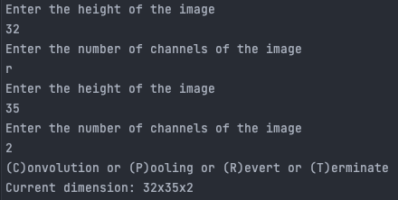

# CNNcalculator
calculate the output size for each of your Convolution or Max Pooling layer!

Set Up:

1. Clone the repo
2. cd into the repo
3. run `python main.py`

Usage Manual:

1. When prompted, enter the width, height, and of channels of your input image 
2. Now you have the option of 
    - entering 'c' or 'C' to calculate the output size of a convolution layer
    - entering 'p' or 'P' to calculate the output size of a max pooling layer
    - entering 'r' or 'R' to revert to the previous dimension (discarding the change made by the latest layer)
    - entering 't' or 'T' to terminate the program
3. Repeat 2. until you are done

- If you made a mistake and want to re-enter your previous input, simply enter 'r' or 'R' (this work for all stages of the program)

- When asking for the options, it will display the current dimension for your reference, as you can also see in the image above

